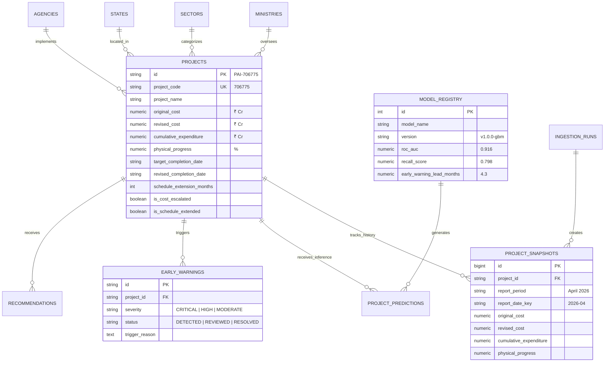

# PAIMANA Predict — Relational Data Model & Schema Specification

## 1. Overview & Normalization Strategy

The PAIMANA Predict relational data model is designed to support **1,981+ ongoing projects**, **10+ chronological monthly snapshot reports**, and multi-dimensional analytics with zero data anomaly risks.

---

## 2. Entity-Relationship Diagram (ERD)



---

## 3. Relational Tables Definition

### 3.1 `projects` (Master Entity)
Stores the authoritative current-state portfolio metadata.
- **Primary Key**: `id` (`VARCHAR(64)`, e.g. `PAI-706775`)
- **Natural Key**: `project_code` (`VARCHAR(32)`, unique numeric MoSPI code)
- **Foreign Keys**: `ministry_id`, `sector_id`, `state_id`, `agency_id`
- **Generated Columns**:
  - `cost_overrun_cr`: `GREATEST(0, revised_cost - original_cost)`
  - `cost_growth_pct`: `ROUND(((revised_cost - original_cost) / original_cost) * 100.0, 2)`
  - `expenditure_ratio_pct`: `ROUND((cumulative_expenditure / revised_cost) * 100.0, 2)`

### 3.2 `project_snapshots` (Temporal Series)
Stores immutable report-by-report historical observations.
- **Unique Constraint**: `(project_id, report_date_key)` &rarr; prevents duplicate observations for the same project in the same reporting cycle.
- **Strict Ordering**: `report_date_key` (`VARCHAR(16)`, format `YYYY-MM`) enables index-accelerated chronological ordering.

### 3.3 `ingestion_runs` (Reconciliation Audit Trail)
Maintains machine-verifiable proof of ingestion integrity.
- Stores extraction checksums, project counts, financial totals, and delta percentages against published MoSPI targets.

---

## 4. Indexing Strategy for Low-Latency Queries

```sql
-- Fast search and ID lookups
CREATE INDEX idx_projects_code ON projects(project_code);

-- Multi-facet filtering indexes
CREATE INDEX idx_projects_ministry ON projects(ministry_id);
CREATE INDEX idx_projects_sector ON projects(sector_id);
CREATE INDEX idx_projects_state ON projects(state_id);

-- Performance sorting for top escalations and progress rankings
CREATE INDEX idx_projects_cost_growth ON projects(cost_growth_pct DESC);
CREATE INDEX idx_projects_progress ON projects(physical_progress);

-- Multi-snapshot timeline joins
CREATE INDEX idx_snapshots_project ON project_snapshots(project_id);
CREATE INDEX idx_snapshots_date_key ON project_snapshots(report_date_key);
```
